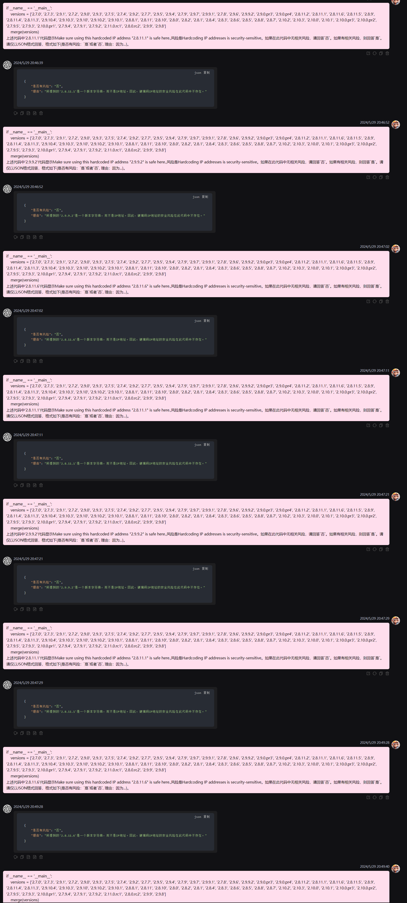

# 运行

运行程序仅需要调用main.py

# 总结

Summary.py会收集dataset中的数据，记录在summary文件夹中

# 分析

analyse.py会统计每个问题的回答情况，并生成summary.xlsx，可以更直观的看回答的详细情况

# 数据

dataset： 所有数据内容

hotspot：每个待审计问题的详细信息

Q1-Q10：10轮回答的情况

question：由待审计问题的信息生成的问题，用于询问大模型

# GPT4-o的询问

"# LLMTest" 
